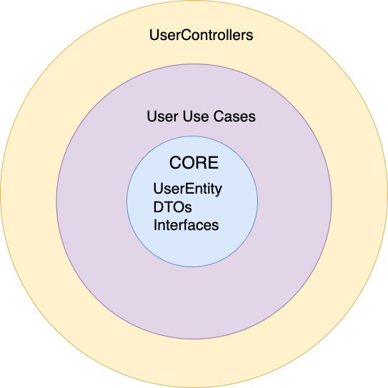
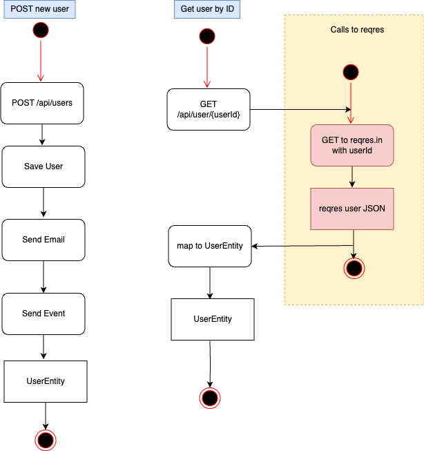
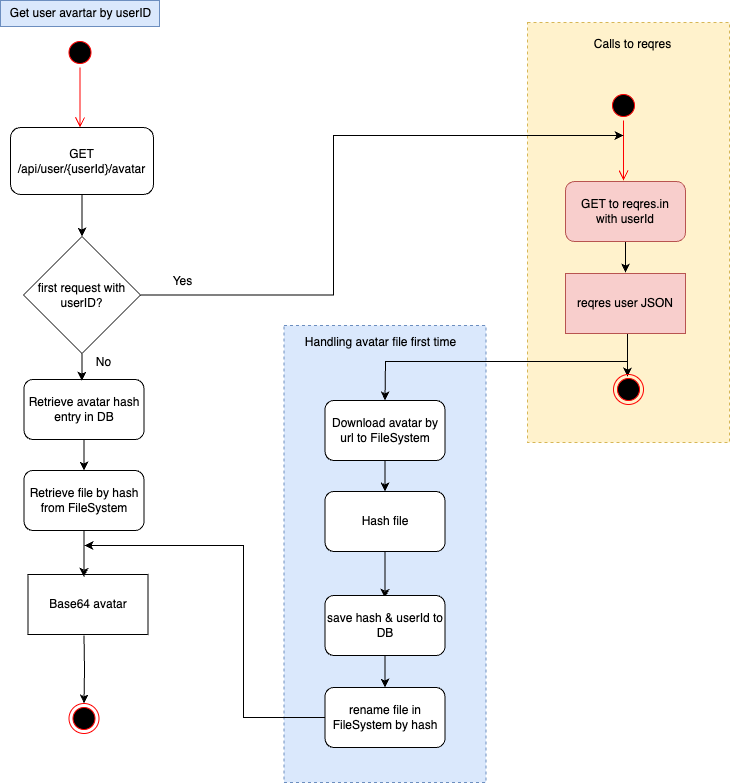
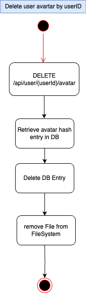

## Description

Users API Application

## Installation

```bash
$ yarn install
```

## Running the app

There is a bash script that runs the app in development mode. Docker and Node.js must be installed on the host machine.

First make the script executable:
```bash
chmod +x start.sh
```

Then run the script:
```bash
./start.sh
```

You can also run the following commands manually:

```bash
# development
$ yarn run start

# watch mode
$ yarn run start:dev

# production mode
$ yarn run start:prod
```

## Test

```bash

# Cucumber tests
$ yarn run test:e2e

```

# Design
According to the resource shared, the project was setup following DDD, heavily inspired by this <a href="https://betterprogramming.pub/clean-node-js-architecture-with-nestjs-and-typescript-34b9398d790f">Clean Node.js Architecture</a>

Here is a diagrammatic summary of the design:
<p align="center">

</p>

# Design Principle
The design principle followed throughout the project is the core of SOLID: that low-level modules should depend on abstractions. This is to ensure that concrete implementations are swappable

# Error Handling
This project uses Excpetion filters provided by NestJs to handle and log unhandled exceptions anywhere they occur.

A possible improvement is to send the logs to Sentry. Also currently, there is only one `AllExceptionsFilter` class that handles all types of exceptions, an improvement is to have different filters for different kind of exceptions e.g `HttpExceptionFilter`

# Environment Variable Handling
This project is capable of working with different kinds of `.env` files, it will automatically check for the corresponding env file depending on the `NODE_ENV` value. E.g when `NODE_ENV=test` it looks for `test.env`

# Activity Diagrams
Here are the activity diagrams according to the problem specification 

<p>Here are the flows for posting a new user and getting a user by ID</>
<p align="center">

</p>

<p>Here is the flow for getting a user avatar by userID</>
<p align="center">

</p>

<p>Here is the flow for deleting a user avatar by userID</>
<p align="center">

</p>

All of theses flows have corresponding scenarios written in Gherkin and automated with cucumber in the `test/` folder

## Posible Improvements
- Include more tests
- Send errors to sentry or others
- Swagger documentation integration